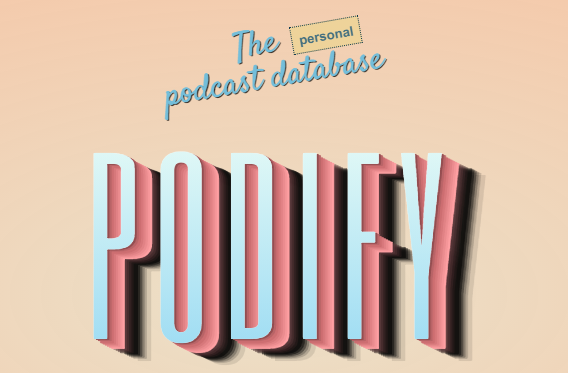

<div align="center">

[![Language][language-shield]][language-url]
[![Language][languageH-shield]][languageH-url]
[![Language][languageC-shield]][languageC-url]
[![MIT License][license-shield]][license-url]

  

#### This is a C# web application that stores Podcasts based on Categories!

<br>

#### _By Paige Tiedeman_

<br>
 
</div>

## Technologies Used

* C#
* .NET v5.0
* ASP.NET Core MVC
* HTML 
* Bootstrap
* MySQL
* CSS
* MySQL Workbench
* Razor
* Entity FrameworkCore
* .NET Core CLI

## Description

This web application lets the user add podcasts and categories, the user can connect podcasts to categories. 

## Installation Requirements

* _Clone or download the zip file of this repository to your desktop_
* _Navigate into the top level directory_
* _Open in your code editor_
* _Commit and push your .gitignore file to your repo_
* _Add the file Podcast.Solution/Podcast/appsettings.json and insert the following:_
```
{
  "ConnectionStrings": {
    "DefaultConnection": "Server=localhost;Port=3306;database=podcast;uid=[YOUR-UID];pwd=[YOUR-PASSWORD-HERE];"
  }
}
```
* _Insert your MySQL password and user Id_
* _Make sure to have .NET 5.0 installed_
* _Run `$ dotnet restore` to install bin & obj folders_
* _Make sure to have EntityFrameworkCore.Design 5.0 added and dotnet ef installed globally_


## Steps To Use
* _In your terminal navigate into Podcast.Solution/Podcast_
* _If Migrations folder is not present run `$ dotnet ef migrations add Initial` to add Migrations folder_
* _Then run `$ dotnet ef database update` to create the schema_
* _Run `$ dotnet build` to build the site_
* _Run `$ dotnet run` to start the live server_
* _Click either button to see all podcasts or categories_
* _After clicking add  put in your inputs and hit submit to reveal the lists!_
* _There is also a search button to search by PodcastName_

## User Stories

<details>
<summary> As A User..</summary>

* I can add a category of podcasts.
* I can add a podcast and description to a category.
* I can add more than one category to a podcast.
* I can search by podcast names to view details.
* I can see the list of podcasts under a category.
* I can edit and delete either categories or podcasts.

</details>

## Known Bugs

* _N/A_

## License

MIT: See Badge at top for Info
Copyright (c) 2021 Paige Tiedeman

## Contact Information

_Paige Tiedeman @ github.com/paigetiedeman_  

[license-shield]: https://img.shields.io/badge/License-MIT-blue
[license-url]: https://opensource.org/licenses/MIT
[language-shield]: https://img.shields.io/badge/Language-C%23-green
[language-url]: https://docs.microsoft.com/en-us/dotnet/csharp/
[LanguageH-shield]: https://img.shields.io/badge/Language-HTML-red
[LanguageH-url]: https://developer.mozilla.org/en-US/docs/Web/HTML
[LanguageC-shield]: https://img.shields.io/badge/Language-CSS-blueviolet
[LanguageC-url]: https://developer.mozilla.org/en-US/docs/Web/CSS